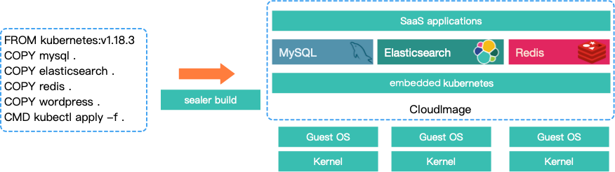
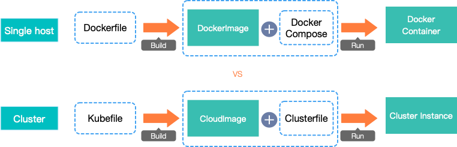

# docker 镜像 VS k8s集群镜像

## docker 章节

### 项目源码地址

1. dockerd : https://github.com/moby/moby.git
2. docker client: https://github.com/docker/cli.git
3. docker registry: https://github.com/distribution/distribution.git

### docker 二进制安装

下载二进制文件： 包括 dockerd 和docker client

```shell
wget https://download.docker.com/linux/static/stable/x86_64/docker-20.10.9.tgz
tar xf docker-20.10.9.tgz
cp docker/* /usr/bin/
```

创建 systemd文件，来管理docker服务的启动。

```shell
cat > /usr/lib/systemd/system/docker.service << EOF
[Unit]
Description=Docker Application Container Engine
Documentation=https://docs.docker.com
After=network-online.target firewalld.service
Wants=network-online.target
[Service]
Type=notify
ExecStart=/usr/bin/dockerd
ExecReload=/bin/kill -s HUP $MAINPID
LimitNOFILE=infinity
LimitNPROC=infinity
LimitCORE=infinity
TimeoutStartSec=0
Delegate=yes
KillMode=process
Restart=on-failure
StartLimitBurst=3
StartLimitInterval=60s
[Install]
WantedBy=multi-user.target
EOF
```

启动设置为开机启动

```shell
systemctl daemon-reload
systemctl start docker
systemctl enable docker
systemctl status docker
```

### docker storage driver overlay 原理以及实战

可以通过`docker info | grep Storage` 查看

```shell
[root@iZ2ze8j92lw0it8zfopuqjZ ~]# docker info | grep Storage
 Storage Driver: overlay2
```

#### overlay filesystem 介绍


##### overlay filesystem 挂载层级

1. lower 层：指定用户需要挂载的lower层目录（支持多lower，最大支持500层）。
2. upper 层：指定用户需要挂载的upper层目录。
3. worker 层：指定文件系统的工作基础目录，挂载后内容会被清空，且在使用过程中其内容用户不可见。
4. merge 层：最终的挂载点目录。

挂载示例：

```shell
mkdir lower upper worker merge
touch lower/l1
touch upper/u1
mount -t overlay overlay -o lowerdir=lower,upperdir=upper,workdir=worker merge
[root@iZbp143f9driomgoqx2krlZ overlay]# mount | grep merge
overlay on /root/overlay/merge type overlay (rw,relatime,lowerdir=lower,upperdir=upper,workdir=worker)
```

#### upper 层产物收集

示例：

```shell
[root@iZbp143f9driomgoqx2krlZ overlay]# ll merge/
total 0
-rw-r--r-- 1 root root 0 Feb 15 09:48 l1
-rw-r--r-- 1 root root 0 Feb 15 09:48 u1
[root@iZbp143f9driomgoqx2krlZ overlay]# touch merge/m1
[root@iZbp143f9driomgoqx2krlZ overlay]# ll upper/
total 0
-rw-r--r-- 1 root root 0 Feb 15 09:51 m1
-rw-r--r-- 1 root root 0 Feb 15 09:48 u1
[root@iZbp143f9driomgoqx2krlZ overlay]# umount /root/overlay/merge
[root@iZbp143f9driomgoqx2krlZ overlay]# ll upper/
total 0
-rw-r--r-- 1 root root 0 Feb 15 09:51 m1
-rw-r--r-- 1 root root 0 Feb 15 09:48 u1
```

##### whiteout文件和opaque属性

###### whiteout文件

Whiteout文件在用户删除文件时创建，用于屏蔽底层的同名文件，同时该文件在merge层是不可见的，所以用户就看不到被删除的文件或目录了。 whiteout文件并非普通文件，而是主次设备号都为0的字符设备
可以通过这样创建: `mknod upper/dir c 0 0`

1. 在merge 层删除lower层文件时候，upper会产生，证明该文件已经被删除，lower层不发生任何变化。
2. 在merge 层新建一个文件，该文件upper层存在格式为whiteout文件文件，则会新建一个真正的文件在upper层，lower层不发生任何变化。

示例：

```shell
mount -t overlay overlay -o lowerdir=lower,upperdir=upper,workdir=worker merge
rm -rf merge/l1
[root@iZbp143f9driomgoqx2krlZ overlay]# umount /root/overlay/merge
[root@iZbp143f9driomgoqx2krlZ overlay]# ll lower/l1 
-rw-r--r-- 1 root root 0 Feb 15 09:48 lower/l1
[root@iZbp143f9driomgoqx2krlZ overlay]# ll upper/l1 
c--------- 1 root root 0, 0 Feb 15 09:55 upper/l1
```

###### opaque 属性

"trusted.overlay.opaque"属性，针对upper层文件夹设置。 upper层中存在一个同名whiteout文件用于隐藏它，然后用户在merge层中又重新创建一个同名目录。
依照overlayfs同名目录上下层合并的理念，如果此处不做任何特殊的处理而仅仅是在upper层中新建一个目录，那原有lower层该目录中的内容会暴露给用户。

它是通过在upper层对应的目录上设置"trusted.overlay.opaque"扩展属性值为"y"
来实现，overlayfs在读取上下层存在同名目录的目录项时，如果upper层的目录被设置了opaque属性，它将忽略这个目录下层的所有同名目录中的目录项，以保证新建的目录是一个空的目录。

1. 在merge 层删除lower层文件夹时候，upper会产生该文件夹对应的whiteout文件，证明该文件已经被删除，lower层不发生任何变化。
2. upper层存在格式为whiteout文件夹,在merge层新建一个同名的文件夹，upper层对应的whiteout文件 恢复为正常文件，且为了不暴露lower同名文件夹，设置该属性为“Y”，lower层不变。
3. 只要从merge层写入目录，那么upper层对应的目录，一定包含 "trusted.overlay.opaque"属性，和lower层目录名字重叠与否无关。

示例：

```shell
mkdir -p lower/ldir1
touch lower/ldir1/ld1
mount -t overlay overlay -o lowerdir=lower,upperdir=upper,workdir=worker merge
[root@iZbp143f9driomgoqx2krlZ overlay]# ll merge/
total 4
drwxr-xr-x 2 root root 4096 Feb 15 10:06 ldir1
-rw-r--r-- 1 root root    0 Feb 15 09:51 m1
-rw-r--r-- 1 root root    0 Feb 15 09:48 u1
rm -rf merge/ldir1
[root@iZbp143f9driomgoqx2krlZ overlay]# ll upper/
total 0
c--------- 1 root root 0, 0 Feb 15 09:55 l1
c--------- 1 root root 0, 0 Feb 15 10:07 ldir1
-rw-r--r-- 1 root root    0 Feb 15 09:51 m1
-rw-r--r-- 1 root root    0 Feb 15 09:48 u1
[root@iZbp143f9driomgoqx2krlZ overlay]# mkdir merge/ldir1
[root@iZbp143f9driomgoqx2krlZ overlay]# ll upper/
total 4
c--------- 1 root root 0, 0 Feb 15 09:55 l1
drwxr-xr-x 2 root root 4096 Feb 15 10:07 ldir1
-rw-r--r-- 1 root root    0 Feb 15 09:51 m1
-rw-r--r-- 1 root root    0 Feb 15 09:48 u1
[root@iZbp143f9driomgoqx2krlZ overlay]# ll upper/ldir1/
total 0
[root@iZbp143f9driomgoqx2krlZ overlay]# ll lower/ldir1/
total 0
-rw-r--r-- 1 root root 0 Feb 15 10:06 ld1
```

查看opaque属性：

```shell
[root@iZbp143f9driomgoqx2krlZ overlay]# getfattr -n "trusted.overlay.opaque" upper/ldir1
# file: upper/ldir1
trusted.overlay.opaque="y"
```

##### 总结

1. 只要在merge层有删除，就将upper层对应文件设置为whiteout文件，无论是删除文件还是目录。
2. 在merge 层新建，就将upper层对应的whiteout文件恢复正常文件包括文件夹和文件，且会对目录设置opaque属性。
3. 无论任何操作，lower 层不发生变化。
4. `getfattr`和`setfattr` 操作在merge层，报错："Operation not supported"，是因为merge层的文件都是挂载得到的。

### docker 镜像 spec文件介绍

```shell
[root@iZ2ze8j92lw0it8zfopuqjZ docker]# docker pull busybox
Using default tag: latest
latest: Pulling from library/busybox
554879bb3004: Pull complete 
Digest: sha256:caa382c432891547782ce7140fb3b7304613d3b0438834dce1cad68896ab110a
Status: Downloaded newer image for busybox:latest
docker.io/library/busybox:latest
[root@iZ2ze8j92lw0it8zfopuqjZ docker]# docker images
REPOSITORY   TAG       IMAGE ID       CREATED       SIZE
busybox      latest    2fb6fc2d97e1   13 days ago   1.24MB
[root@iZ2ze8j92lw0it8zfopuqjZ docker]# docker inspect 2fb6fc2d97e1
[
    {
        "Id": "sha256:2fb6fc2d97e10c79983aa10e013824cc7fc8bae50630e32159821197dda95fe3",
        "RepoTags": [
            "busybox:latest"
        ],
        "RepoDigests": [
            "busybox@sha256:caa382c432891547782ce7140fb3b7304613d3b0438834dce1cad68896ab110a"
        ],
        "Parent": "",
        "Comment": "",
        "Created": "2022-03-11T20:19:46.866228701Z",
        "Container": "40d701f1dae2cd64371538316ceab897376369fccf7387f9320365b750429e26",
        "ContainerConfig": {
            "Hostname": "40d701f1dae2",
            "Domainname": "",
            "User": "",
            "AttachStdin": false,
            "AttachStdout": false,
            "AttachStderr": false,
            "Tty": false,
            "OpenStdin": false,
            "StdinOnce": false,
            "Env": [
                "PATH=/usr/local/sbin:/usr/local/bin:/usr/sbin:/usr/bin:/sbin:/bin"
            ],
            "Cmd": [
                "/bin/sh",
                "-c",
                "#(nop) ",
                "CMD [\"sh\"]"
            ],
            "Image": "sha256:9bb793014cc6e3bc93699a3463383a42925d43c5c54ccf20dc93bfbbe303eeea",
            "Volumes": null,
            "WorkingDir": "",
            "Entrypoint": null,
            "OnBuild": null,
            "Labels": {}
        },
        "DockerVersion": "20.10.12",
        "Author": "",
        "Config": {
            "Hostname": "",
            "Domainname": "",
            "User": "",
            "AttachStdin": false,
            "AttachStdout": false,
            "AttachStderr": false,
            "Tty": false,
            "OpenStdin": false,
            "StdinOnce": false,
            "Env": [
                "PATH=/usr/local/sbin:/usr/local/bin:/usr/sbin:/usr/bin:/sbin:/bin"
            ],
            "Cmd": [
                "sh"
            ],
            "Image": "sha256:9bb793014cc6e3bc93699a3463383a42925d43c5c54ccf20dc93bfbbe303eeea",
            "Volumes": null,
            "WorkingDir": "",
            "Entrypoint": null,
            "OnBuild": null,
            "Labels": null
        },
        "Architecture": "amd64",
        "Os": "linux",
        "Size": 1239748,
        "VirtualSize": 1239748,
        "GraphDriver": {
            "Data": {
                "MergedDir": "/var/lib/docker/overlay2/6e4e90b944bbc3d6b2533c7c1ade724fcf940ecfde72bc4d93afc004d4e6b310/merged",
                "UpperDir": "/var/lib/docker/overlay2/6e4e90b944bbc3d6b2533c7c1ade724fcf940ecfde72bc4d93afc004d4e6b310/diff",
                "WorkDir": "/var/lib/docker/overlay2/6e4e90b944bbc3d6b2533c7c1ade724fcf940ecfde72bc4d93afc004d4e6b310/work"
            },
            "Name": "overlay2"
        },
        "RootFS": {
            "Type": "layers",
            "Layers": [
                "sha256:797ac4999b67d8c38a596919efa5b7b6a4a8fd5814cb8564efa482c5d8403e6d"
            ]
        },
        "Metadata": {
            "LastTagTime": "0001-01-01T00:00:00Z"
        }
    }
]

```

### docker 镜像存储介绍

#### local registry

##### local registry repository

此处的repositories.json 存储整个系统中的镜像信息，是整个镜像相关操作的入口。

```shell
[root@iZ2ze8j92lw0it8zfopuqjZ ~]# cat /var/lib/docker/image/overlay2/repositories.json  | jq
{
  "Repositories": {
    "busybox": {
      "busybox:latest": "sha256:2fb6fc2d97e10c79983aa10e013824cc7fc8bae50630e32159821197dda95fe3",
      "busybox@sha256:caa382c432891547782ce7140fb3b7304613d3b0438834dce1cad68896ab110a": "sha256:2fb6fc2d97e10c79983aa10e013824cc7fc8bae50630e32159821197dda95fe3"
    }
  }
}
```

##### local image db

此处的 `2fb6fc2d97e10c79983aa10e013824cc7fc8bae50630e32159821197dda95fe3`就是实际的image id了内容和`docker inspect `的一样。

```shell
[root@iZ2ze8j92lw0it8zfopuqjZ ~]# tree /var/lib/docker/image/overlay2/imagedb/
/var/lib/docker/image/overlay2/imagedb/
├── content
│   └── sha256
│       └── 2fb6fc2d97e10c79983aa10e013824cc7fc8bae50630e32159821197dda95fe3
└── metadata
    └── sha256

```

##### local layer db

此处的 `797ac4999b67d8c38a596919efa5b7b6a4a8fd5814cb8564efa482c5d8403e6d`是layer数据层在本地的缓存，也包含真实数据，不过是被压缩了的。 也会在在image
spec文件中注册。

```shell
[root@iZ2ze8j92lw0it8zfopuqjZ ~]# tree /var/lib/docker/image/overlay2/layerdb/
/var/lib/docker/image/overlay2/layerdb/
├── sha256
│   └── 797ac4999b67d8c38a596919efa5b7b6a4a8fd5814cb8564efa482c5d8403e6d
│       ├── cache-id
│       ├── diff
│       ├── size
│       └── tar-split.json.gz
└── tmp
```

##### local layer data

此处的 `6e4e90b944bbc3d6b2533c7c1ade724fcf940ecfde72bc4d93afc004d4e6b310` 即就是被挂载到container中的真实数据。 也会在在image spec文件中注册。

```shell
[root@iZ2ze8j92lw0it8zfopuqjZ ~]# tree /var/lib/docker/overlay2
/var/lib/docker/overlay2
├── 6e4e90b944bbc3d6b2533c7c1ade724fcf940ecfde72bc4d93afc004d4e6b310
│   ├── diff
│   │   ├── bin
│   │   │   ├── [
│   │   │   ├── [[
│   │   │   ├── acpid
│   │   │   ├── addgroup
│   │   │   ├── add-shell
│   │   │   ├── adduser
│   │   │   ├── adjtimex
│   │   │   ├── ar
│   │   │   ├── arch
│   │   │   ├── arp

```

##### local distribution registry 注册信息

```shell
/var/lib/docker/image/overlay2/distribution/
├── diffid-by-digest
│   └── sha256
│       └── 554879bb300427c7301c1cbdf266a7eba24a85b10d19f270b3d348b9eb9ca7df
└── v2metadata-by-diffid
    └── sha256
        └── 797ac4999b67d8c38a596919efa5b7b6a4a8fd5814cb8564efa482c5d8403e6d
```

```shell
[root@iZ2ze8j92lw0it8zfopuqjZ ~]# cat /var/lib/docker/image/overlay2/distribution/v2metadata-by-diffid/sha256/797ac4999b67d8c38a596919efa5b7b6a4a8fd5814cb8564efa482c5d8403e6d 
[{"Digest":"sha256:554879bb300427c7301c1cbdf266a7eba24a85b10d19f270b3d348b9eb9ca7df","SourceRepository":"docker.io/library/busybox","HMAC":""}] 

[root@iZ2ze8j92lw0it8zfopuqjZ ~]# cat /var/lib/docker/image/overlay2/distribution/diffid-by-digest/sha256/554879bb300427c7301c1cbdf266a7eba24a85b10d19f270b3d348b9eb9ca7df 
sha256:797ac4999b67d8c38a596919efa5b7b6a4a8fd5814cb8564efa482c5d8403e6d
```

##### 整个镜像存储的概览图

```shell
[root@iZ2ze8j92lw0it8zfopuqjZ ~]# tree /var/lib/docker/image/
/var/lib/docker/image/
└── overlay2
    ├── distribution
    │   ├── diffid-by-digest
    │   │   └── sha256
    │   │       └── 554879bb300427c7301c1cbdf266a7eba24a85b10d19f270b3d348b9eb9ca7df
    │   └── v2metadata-by-diffid
    │       └── sha256
    │           └── 797ac4999b67d8c38a596919efa5b7b6a4a8fd5814cb8564efa482c5d8403e6d
    ├── imagedb
    │   ├── content
    │   │   └── sha256
    │   │       └── 2fb6fc2d97e10c79983aa10e013824cc7fc8bae50630e32159821197dda95fe3
    │   └── metadata
    │       └── sha256
    ├── layerdb
    │   ├── sha256
    │   │   └── 797ac4999b67d8c38a596919efa5b7b6a4a8fd5814cb8564efa482c5d8403e6d
    │   │       ├── cache-id
    │   │       ├── diff
    │   │       ├── size
    │   │       └── tar-split.json.gz
    │   └── tmp
    └── repositories.json

```

#### remote distribution registry

这个小节主要是讲解，本地的registry数据如何存储到远程的distribution registry中，以及远程的数据如何在本地registry中注册。

m命令行：

```shell
docker push base:v1
docker pull base:v1
```

##### 数据格式介绍

###### distribution registry Manifest list

包括这个镜像的所有Manifest 信息,以及主要对应的host架构例如 arm,amd 等等的区分。

```shell
{
    "manifests": [
        {
            "digest": "sha256:d5c6e74e3115b55dce759c1b3a52b1d2db60dc6929681de2f76cdc5d6f4d7412",
            "mediaType": "application/vnd.docker.distribution.manifest.v2+json",
            "platform": {
                "architecture": "amd64",
                "os": "linux"
            },
            "size": 527
        },
        {
            "digest": "sha256:9e596d0a54177f29093236f65a9c6098590c67ea8b0dde4e09a5a49124cec7d0",
            "mediaType": "application/vnd.docker.distribution.manifest.v2+json",
            "platform": {
                "architecture": "arm",
                "os": "linux",
                "variant": "v5"
            },
            "size": 527
        },
        {
            "digest": "sha256:634f52ec84384c3bcf8df8650bb169a7a42d9f55a9c0559c8ed80db62656dca3",
            "mediaType": "application/vnd.docker.distribution.manifest.v2+json",
            "platform": {
                "architecture": "arm",
                "os": "linux",
                "variant": "v6"
            },
            "size": 527
        },
        {
            "digest": "sha256:2104e7894db6986e4a0b94bc27a63fb27905058269bbe3ca4d850a0f31ed8831",
            "mediaType": "application/vnd.docker.distribution.manifest.v2+json",
            "platform": {
                "architecture": "arm",
                "os": "linux",
                "variant": "v7"
            },
            "size": 527
        },
        {
            "digest": "sha256:9a52cf1f62902043be85200d71aa1834a4bb619c7b68cb83523cc76715eacb15",
            "mediaType": "application/vnd.docker.distribution.manifest.v2+json",
            "platform": {
                "architecture": "arm64",
                "os": "linux",
                "variant": "v8"
            },
            "size": 527
        },
        {
            "digest": "sha256:48ba6c9ad9c227a2ca8312e39588987956df56d645aa20de71291a24b3653847",
            "mediaType": "application/vnd.docker.distribution.manifest.v2+json",
            "platform": {
                "architecture": "386",
                "os": "linux"
            },
            "size": 527
        },
        {
            "digest": "sha256:e4c49d442a61b2490515502d6dc250d333f257f223421d12ac78cba6ee888791",
            "mediaType": "application/vnd.docker.distribution.manifest.v2+json",
            "platform": {
                "architecture": "mips64le",
                "os": "linux"
            },
            "size": 527
        },
        {
            "digest": "sha256:4c3feb18c13e46a76e35f9c01dc901f5d03aca45ac712f1fdabca614bb246bf5",
            "mediaType": "application/vnd.docker.distribution.manifest.v2+json",
            "platform": {
                "architecture": "ppc64le",
                "os": "linux"
            },
            "size": 528
        },
        {
            "digest": "sha256:60ef5efc5f53395f1aed2c11632b858f303465e86392a5b9786941d285027444",
            "mediaType": "application/vnd.docker.distribution.manifest.v2+json",
            "platform": {
                "architecture": "riscv64",
                "os": "linux"
            },
            "size": 527
        },
        {
            "digest": "sha256:46577269bd88a558bf39a0ddaafbf9bf89a383d6f66e4699bbed4225998b8fc6",
            "mediaType": "application/vnd.docker.distribution.manifest.v2+json",
            "platform": {
                "architecture": "s390x",
                "os": "linux"
            },
            "size": 528
        }
    ],
    "mediaType": "application/vnd.docker.distribution.manifest.list.v2+json",
    "schemaVersion": 2
}
```

###### distribution registry Manifest.json

真正的 Manifest 信息，包括镜像的config spec 信息和对应的layer id.

```shell
{
   "schemaVersion": 2,
   "mediaType": "application/vnd.docker.distribution.manifest.v2+json",
   "config": {
      "mediaType": "application/vnd.docker.container.image.v1+json",
      "size": 1454,
      "digest": "sha256:d23834f29b3875b6759be00a48013ba523c6a89fcbaeaa63607512118a9c4c19"
   },
   "layers": [
      {
         "mediaType": "application/vnd.docker.image.rootfs.diff.tar.gzip",
         "size": 772786,
         "digest": "sha256:3aab638df1a9e5bd507442990a0fa8f97c2c48870922f44675c22d0b9060cf66"
      }
   ]
}
```

###### distribution registry Layer config

真正的镜像config spec信息了,会在`docker pull`的时候注册到本地的registry中。 内容和 `docker inspect`一摸一样。

```shell
{
    "architecture": "amd64",
    "config": {
        "Hostname": "",
        "Domainname": "",
        "User": "",
        "AttachStdin": false,
        "AttachStdout": false,
        "AttachStderr": false,
        "Tty": false,
        "OpenStdin": false,
        "StdinOnce": false,
        "Env": [
            "PATH=/usr/local/sbin:/usr/local/bin:/usr/sbin:/usr/bin:/sbin:/bin"
        ],
        "Cmd": [
            "sh"
        ],
        "Image": "sha256:b245512a151f53e7e64304917c6306625a3ceab812aad658f8c01cda63db6002",
        "Volumes": null,
        "WorkingDir": "",
        "Entrypoint": null,
        "OnBuild": null,
        "Labels": null
    },
    "container": "414496a7a16fae6e29e333253f0276761c53f9e86bf853786269143fe569a6ad",
    "container_config": {
        "Hostname": "414496a7a16f",
        "Domainname": "",
        "User": "",
        "AttachStdin": false,
        "AttachStdout": false,
        "AttachStderr": false,
        "Tty": false,
        "OpenStdin": false,
        "StdinOnce": false,
        "Env": [
            "PATH=/usr/local/sbin:/usr/local/bin:/usr/sbin:/usr/bin:/sbin:/bin"
        ],
        "Cmd": [
            "/bin/sh",
            "-c",
            "#(nop) ",
            "CMD [\"sh\"]"
        ],
        "Image": "sha256:b245512a151f53e7e64304917c6306625a3ceab812aad658f8c01cda63db6002",
        "Volumes": null,
        "WorkingDir": "",
        "Entrypoint": null,
        "OnBuild": null,
        "Labels": {}
    },
    "created": "2021-11-30T04:12:57.77167913Z",
    "docker_version": "20.10.7",
    "history": [
        {
            "created": "2021-11-30T04:12:57.548397673Z",
            "created_by": "/bin/sh -c #(nop) ADD file:b361e7f6a3dde1686afb8dc8cd03f045683bc6a924d3baefa84f89a0be2272cf in / "
        },
        {
            "created": "2021-11-30T04:12:57.77167913Z",
            "created_by": "/bin/sh -c #(nop)  CMD [\"sh\"]",
            "empty_layer": true
        }
    ],
    "os": "linux",
    "rootfs": {
        "type": "layers",
        "diff_ids": [
            "sha256:9f2549622fec760f90ed0383b7ca50e23c12254accf9cb2bc0db705454de852a"
        ]
    }
}
```

#### 本地文件系统存储

```shell
├── docker
│   └── registry
│       └── v2
│           ├── blobs // 真正的数据存储
│           │   └── sha256
│           │       ├── 09
│           │       │   └── 092c822dea67ab2d03cf39c60d0f28925815e05899e5e780fd16b09c8da2756d
│           │       │       └── data

│           └── repositories// 仓库信息
│               ├── kubernetesui
│               │   └── dashboard
│               │       ├── _layers //  镜像conifg id 和对应的layer id
│               │       │   └── sha256
│               │       │       ├── 104583f882773ec97808dfd4f4188b7ec3b58aa538276a607e5f5d27769c148f
│               │       │       │   └── link
│               │       │       ├── 14a23d4cb52dd7daed090909f22dc02f37391250f6d7b74e59356125aa4c1072
│               │       │       │   └── link
│               │       │       └── 3ab00e3fe8b54c781fda4e7fc88b09e5f8bcb93601ca3bf37b5cabe2adf8e0a9
│               │       │           └── link
│               │       └── _manifests // 镜像 manifest id 和manifest list id
│               │           ├── revisions
│               │           │   └── sha256
│               │           │       ├── 148991563e374c83b75e8c51bca75f512d4f006ddc791e96a91f1c7420b60bd9
│               │           │       │   └── link // manifest list  指定当前镜像manifest list 文件id, 该文件包含该镜像所有的manifest 数据不同的arch版本和os 版本。
│               │           │       └── 478185375efe04de596d637534c268b6791e723b05dcffed4e3c4aa8c72b435c
│               │           │           └── link // manifest  指定当前镜像manifest 文件id, 该文件包含该镜像所有的 confing数据和多个layer id.
│               │           └── tags
│               │               └── v2.2.0
│               │                   ├── current
│               │                   │   └── link
│               │                   └── index
│               │                       └── sha256
│               │                           └── 148991563e374c83b75e8c51bca75f512d4f006ddc791e96a91f1c7420b60bd9
│               │                               └── link 
```

### docker 镜像构建实战

使用golang，写一个web http server,并使用docker 构建的镜像运行起来，在本地通过8080端口能够访问。

Dockerfile

```shell
FROM golang:1.16-alpine
MAINTAINER ZhouKa <kaka@zhou.com>
WORKDIR $GOPATH/src/godocker
ADD main.go $GOPATH/src/godocker
RUN go build -o app main.go
EXPOSE 8080
ENTRYPOINT ["./app"]
```

myapp golang 源码：

```go
package main

import (
	"net/http"
	"fmt"
)

func main() {
	http.HandleFunc("/hello", hello)
	http.ListenAndServe(":8080", nil)

}

func hello(w http.ResponseWriter, r *http.Request) {
	fmt.Fprintln(w, "Hello Docker Form Golang!")
}
```

构建容器

```shell
docker build -t my-app:v1 -f Dockerfile .
```

启动容器

```shell
docker run -p 8080:8080 -d my-app:v1
```

测试：

```shell
curl http://127.0.0.1:8080/hello
```

#### 镜像构建tips

这个是面试高频问题啊。

1. Layers: Dockerfile 中的每个命令都会生成一个。经验法则是创建尽可能少的层，并将很少更改的层与经常更改的层分开。
2. Dockerfile 结构：“FMERAEEC” 法则： FROM, MAINTAINER, ENV, RUN, ADD, ENTRYPOINT, EXPOSE & CMD。
3. 基础镜像的选择： FROM 建议不要使用 "latest"的公开基础镜像,因为会有bug~~。
4. MAINTAINER 书写的时候，尊崇 RFC格式，如果你懒得写就忽略这一条。`MAINTAINER ZhouKa <kaka@zhou.com>`
5. ENV 指令： 如果构建的镜像是安装一个packages那么写上ENV指令就很灵活了。 `ENV NGINX_VERSION 1.9.12`
6. RUN 指令：尽最大的使用一条命令完成所有事情。镜像小不小就看RUN 指令写的好不好。
7. 删除 安装缓存和日志文件：使用apt-get install或者是yum 等安装工具，记得清理。
8. 不要在docker file中build源码，重要的事情说一遍。
9. 复制文件尽量使用add 命令，因为copy后续会被废弃。而且也不用 "run mkdir",因为docker会自动创建。
10. ENTRYPOINT 指令：会在容器启动的时候被执行，强烈建议使用它来配置容器启动。和cmd 做参数配合，嗯～，真香。
11. 构建完成一定记得清理过程文件，减少层数。例如build的过程产物，

### docker build 后续发展

下一代构建神器 buildkit ：https://github.com/moby/buildkit.git

"concurrent, cache-efficient, and Dockerfile-agnostic builder toolkit"

Key features:

1. Automatic garbage collection
2. Extendable frontend formats
3. Concurrent dependency resolution
4. Efficient instruction caching
5. Build cache import/export
6. Nested build job invocations
7. Distributable workers
8. Multiple output formats
9. Pluggable architecture
10. Execution without root privileges

## k8s 章节

### 项目源码地址和官网

1. sealer : https://github.com/alibaba/sealer.git
2. 官网： http://sealer.cool/docs/getting-started/introduction.html

### k8s 集群镜像工具安装

```shell
wget https://sealer.oss-cn-beijing.aliyuncs.com/sealers/sealer-v0.7.1-linux-amd64.tar.gz
tar zxvf sealer-v0.7.1-linux-amd64.tar.gz && mv sealer /usr/local/bin/
```

### k8s 集群镜像介绍

#### 集群镜像架构介绍



docker 镜像和K8s集群镜像对比：



#### build 指令介绍

##### FROM 指令

FROM: 引用一个基础镜像，并且Kubefile中第一条指令必须是FROM指令。若基础镜像为私有仓库镜像，则需要仓库认证信息，另外 sealer社区提供了官方的基础镜像可供使用。

> 命令格式：FROM {your base image name}

使用样例：

例如上面示例中,使用sealer 社区提供的`kubernetes:v1.19.8`作为基础镜像。

`FROM registry.cn-qingdao.aliyuncs.com/sealer-io/kubernetes:v1.19.8`

##### COPY 指令

COPY: 复制构建上下文中的文件或者目录到rootfs中。

集群镜像文件结构均基于rootfs结构,默认的目标路径即为rootfs，且当指定的目标目录不存在时会自动创建。

如需要复制系统命令，例如复制二进制文件到操作系统的$PATH，则需要复制到rootfs中的bin目录，该二进制文件会在镜像构建和启动时，自动加载到系统$PATH中。

> 命令格式：COPY {src dest}

使用样例：

复制mysql.yaml到rootfs目录中。

`COPY mysql.yaml .`

复制可执行文件到系统$PATH中。

`COPY helm ./bin`

复制远程文件或者git仓库到cloud image中。

`COPY https://github.com/alibaba/sealer/raw/main/applications/cassandra/cassandra-manifest.yaml manifests`

支持通配符复制，将test目录下所有yaml文件复制到manifests中。

`COPY test/*.yaml manifests`

##### ARG 指令

ARG: 支持在build阶段设置命令行参数，用于配合CMD和RUN指令使用。

> 命令格式：ARG <参数名>[=<默认值>]

使用样例：

```shell
FROM kubernetes:v1.19.8
# set default version is 4.0.0, this will be used to install mongo application.
ARG Version=4.0.0 
# mongo dir contains many mongo version yaml file.
COPY mongo manifests
# arg Version can be used with RUN instruction.
RUN echo ${Version} 
# use Version arg to install mongo application.
CMD kubectl apply -f mongo-${Version}.yaml 
```

这样就会在build时候启动一个"Version=4.0.0"的yaml.

##### RUN 指令

RUN: 使用系统shell执行构建命令，仅在build时运行，可接受多个命令参数，且构建时会将命令执行产物结果保存在镜像中。若系统命令不存在则会构建失败,则需要提前执行COPY指令，将命令复制到镜像中。

> 命令格式：RUN {command args ...}

使用样例：

例如上面示例中,使用wget 命令下载一个kubernetes的dashboard。

`RUN wget https://raw.githubusercontent.com/kubernetes/dashboard/v2.2.0/aio/deploy/recommended.yaml`

##### CMD 指令

CMD: 与RUN指令格式类似，使用系统shell执行构建命令。但CMD指令会在镜像启动的时候执行，一般用于启动和配置集群使用。另外与Dockerfile中CMD指令不同，一个kubefile中可以有多个CMD指令。

> 命令格式：CMD {command args ...}

使用样例：

例如上面示例中,使用 kubectl 命令安装一个kubernetes的dashboard。

`CMD kubectl apply -f recommended.yaml`

#### 集群镜像存储格式

##### rootfs 树状图

```
.
├── bin
│   ├── conntrack
│   ├── containerd-rootless-setuptool.sh
│   ├── containerd-rootless.sh
│   ├── crictl
│   ├── kubeadm
│   ├── kubectl
│   ├── kubelet
│   ├── nerdctl
│   └── seautil
├── cri
│   └── docker.tar.gz # cri bin files include docker,containerd,runc. 
├── etc
│   ├── 10-kubeadm.conf
│   ├── Clusterfile  # image default Clusterfile
│   ├── daemon.json # docker daemon config file. 
│   ├── docker.service 
│   ├── kubeadm.yml # kubeadm config including Cluster Configuration,JoinConfiguration and so on.
│   ├── kubelet.service
│   ├── registry_config.yml # docker registry config including storage root directory and http related config.
│   └── registry.yml # If the user wants to customize the username and password, can overwrite this file.
├── images
│   └── registry.tar  # registry docker image, will load this image and run a local registry in cluster
├── Kubefile
├── Metadata
├── README.md
├── registry # will mount this dir to local registry
│   └── docker
│       └── registry
├── scripts
│   ├── clean.sh
│   ├── docker.sh
│   ├── init-kube.sh
│   ├── init-registry.sh
│   ├── init.sh
│   └── kubelet-pre-start.sh
└── statics # yaml files, sealer will render values in those files
    └── audit-policy.yml
```

##### 特殊目录介绍

###### images 目录

cloud image docker 镜像文件目录，启动cloud image的时候会将改目录内的离线镜像导入到内置registry中。

样例：复制离线镜像到此目录。

`COPY mysql.tar images`

###### plugin 目录

cloud image 插件文件目录，启动cloud image的时候会将改目录内插件配置加载到runtime中被执行。

样例：复制插件配置文件到此目录。

插件配置 shell.yaml:

```
apiVersion: sealer.aliyun.com/v1alpha1
kind: Plugin
metadata:
  name: taint
spec:
  type: SHELL
  action: PostInstall
  on: node-role.kubernetes.io/master=
  data: |
     kubectl taint nodes --all node-role.kubernetes.io/master-
```

`COPY shell.yaml plugins`

###### charts 目录

cloud image charts文件目录，sealer build 的时候会解析该目录中的charts文件，将对应的容器镜像下载并保存。

样例：nginx charts包到此目录。

`COPY nginx charts`

###### manifests 目录

cloud image manifests文件目录，sealer build 的时候会解析该目录中的yaml文件和imageList文件，将对应的容器镜像下载并保存。

样例：复制imageList文件到manifests目录。

```shell
[root@iZbp143f9driomgoqx2krlZ build]# cat imageList 
busybox
```

`COPY imageList manifests`

样例：复制dashboard yaml 文件到manifests目录。

`COPY recommend.yaml manifests`

### k8s 集群镜像构建实战

需求：构建一个K8s的集群镜像，并且包含了k8s的dashboard。

Kubefile

```shell
FROM registry.cn-qingdao.aliyuncs.com/sealer-io/kubernetes:v1.19.8
COPY  recommended.yaml manifests
# when run this CloudImage, will apply a dashboard manifests
CMD kubectl apply -f manifests/recommended.yaml
```

build cmd line:

`sealer build -t my-dashboard:v1 .`

查看构建的基础镜像

`sealer inspect my-dashboard:v1`

run cmd line:

```shell
sealer run -m 172.16.0.229 -p Seadent123 my-dashboard:v1
# check the pod
kubectl get pod -A|grep dashboard
```
