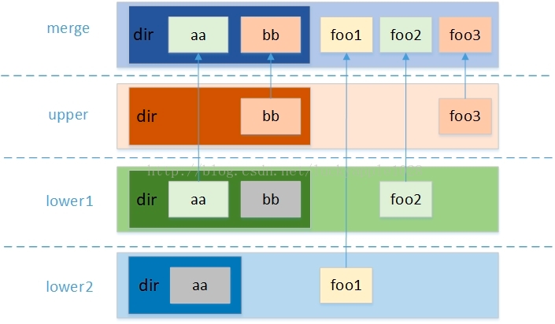
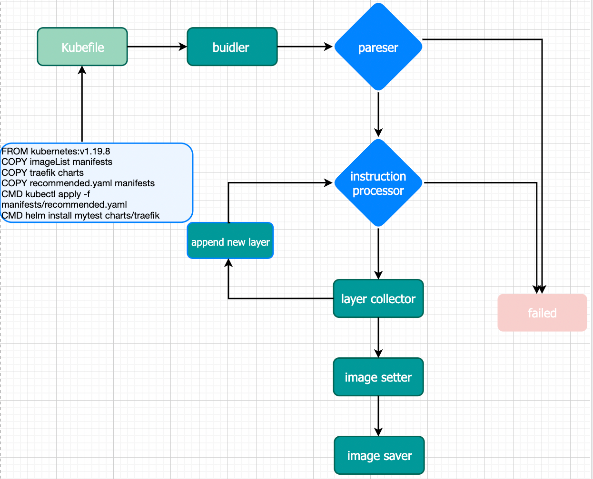

## 背景介绍

## cloud image rootfs 镜像内容介绍

### rootfs 树状图

```
.
├── bin
│   ├── conntrack
│   ├── containerd-rootless-setuptool.sh
│   ├── containerd-rootless.sh
│   ├── crictl
│   ├── kubeadm
│   ├── kubectl
│   ├── kubelet
│   ├── nerdctl
│   └── seautil
├── cri
│   └── docker.tar.gz # cri bin files include docker,containerd,runc. 
├── etc
│   ├── 10-kubeadm.conf
│   ├── Clusterfile  # image default Clusterfile
│   ├── daemon.json # docker daemon config file. 
│   ├── docker.service 
│   ├── kubeadm.yml # kubeadm config including Cluster Configuration,JoinConfiguration and so on.
│   ├── kubelet.service
│   ├── registry_config.yml # docker registry config including storage root directory and http related config.
│   └── registry.yml # If the user wants to customize the username and password, can overwrite this file.
├── images
│   └── registry.tar  # registry docker image, will load this image and run a local registry in cluster
├── Kubefile
├── Metadata
├── README.md
├── registry # will mount this dir to local registry
│   └── docker
│       └── registry
├── scripts
│   ├── clean.sh
│   ├── docker.sh
│   ├── init-kube.sh
│   ├── init-registry.sh
│   ├── init.sh
│   └── kubelet-pre-start.sh
└── statics # yaml files, sealer will render values in those files
    └── audit-policy.yml
```

### 特殊目录介绍

#### images 目录

cloud image docker 镜像文件目录，启动cloud image的时候会将改目录内的离线镜像导入到内置registry中。

样例：复制离线镜像到此目录。

`COPY mysql.tar images`

#### plugin 目录

cloud image 插件文件目录，启动cloud image的时候会将改目录内插件配置加载到runtime中被执行。

样例：复制插件配置文件到此目录。

插件配置 shell.yaml:

```
apiVersion: sealer.aliyun.com/v1alpha1
kind: Plugin
metadata:
  name: taint
spec:
  type: SHELL
  action: PostInstall
  on: node-role.kubernetes.io/master=
  data: |
     kubectl taint nodes --all node-role.kubernetes.io/master-
```

`COPY shell.yaml plugins`

#### charts 目录

cloud image charts文件目录，sealer build 的时候会解析该目录中的charts文件，将对应的容器镜像下载并保存。

样例：nginx charts包到此目录。

`COPY nginx charts`

#### manifests 目录

cloud image manifests文件目录，sealer build 的时候会解析该目录中的yaml文件和imageList文件，将对应的容器镜像下载并保存。

样例：复制imageList文件到manifests目录。

```shell
[root@iZbp143f9driomgoqx2krlZ build]# cat imageList 
busybox
```

`COPY imageList manifests`

样例：复制dashboard yaml 文件到manifests目录。

`COPY recommend.yaml manifests`

## build 模式介绍

### lite 模式

sealer 默认的构建模式，该种构建模式根据Kubefile的定义，实现不用拉起kubernetes集群的轻量化构建。用于已知镜像清单，或者没有特殊的资源需求的场景。

核心功能介绍

1. 基础集群镜像的拉取和挂载。
2. 根据kubefile执行构建指令,收集相关产物。
3. 根据特殊目录中的构建产物，收集构建过程中产生的容器镜像。
4. 设置cloud image的相关属性并保存镜像。

### local 模式

实现对cloud build模式的本地化构建，以及对无需收集docker镜像的构建方式的支持，例如from scratch的构建。

核心功能介绍

1. 基础集群镜像的拉取和挂载。
2. 根据kubefile执行构建指令,收集相关产物。
3. 根据特殊目录中的构建产物，收集构建过程中产生的容器镜像。
4. 收集对应的集群中pod的镜像。例如启动的operator中容器镜像。
5. 设置cloud image的相关属性并保存镜像。

### cloud 模式

基于云服务，自动化创建ecs并部署kubernetes集群并构建镜像，如果您要交付的环境涉及例如分布式存储这样的底层资源，或者有operator方式启动的工作负载，建议使用此方式来进行构建。

核心功能介绍

1. 使用AKSK,启动云服务的基础资源,ECS,VPC等等。
2. 使用ssh发送构建上下文以及sealer二进制，用于构建环境的准备。
3. 远程执行ssh 命令，完成集群镜像的构建。
4. 清理环境，云服务资源的回收。

### container 模式

与cloud build 原理类似，通过启动多个docker容器作为kubernetes节点（模拟cloud模式的ECS）,从而启动一个kubernetes集群的方式来进行构建。

## build 指令介绍

### FROM 指令

FROM: 引用一个基础镜像，并且Kubefile中第一条指令必须是FROM指令。若基础镜像为私有仓库镜像，则需要仓库认证信息，另外 sealer社区提供了官方的基础镜像可供使用。

> 命令格式：FROM {your base image name}

使用样例：

例如上面示例中,使用sealer 社区提供的`kubernetes:v1.19.8`作为基础镜像。

`FROM registry.cn-qingdao.aliyuncs.com/sealer-io/kubernetes:v1.19.8`

### COPY 指令

COPY: 复制构建上下文中的文件或者目录到rootfs中。

集群镜像文件结构均基于rootfs结构,默认的目标路径即为rootfs，且当指定的目标目录不存在时会自动创建。

如需要复制系统命令，例如复制二进制文件到操作系统的$PATH，则需要复制到rootfs中的bin目录，该二进制文件会在镜像构建和启动时，自动加载到系统$PATH中。

> 命令格式：COPY {src dest}

使用样例：

复制mysql.yaml到rootfs目录中。

`COPY mysql.yaml .`

复制可执行文件到系统$PATH中。

`COPY helm ./bin`

复制远程文件或者git仓库到cloud image中。

`COPY https://github.com/alibaba/sealer/raw/main/applications/cassandra/cassandra-manifest.yaml manifests`

支持通配符复制，将test目录下所有yaml文件复制到manifests中。

`COPY test/*.yaml manifests`

### ARG 指令

ARG: 支持在build阶段设置命令行参数，用于配合CMD和RUN指令使用。

> 命令格式：ARG <参数名>[=<默认值>]

使用样例：

```shell
FROM kubernetes:v1.19.8
# set default version is 4.0.0, this will be used to install mongo application.
ARG Version=4.0.0 
# mongo dir contains many mongo version yaml file.
COPY mongo manifests
# arg Version can be used with RUN instruction.
RUN echo ${Version} 
# use Version arg to install mongo application.
CMD kubectl apply -f mongo-${Version}.yaml 
```

这样就会在build时候启动一个"Version=4.0.0"的yaml.

### RUN 指令

RUN: 使用系统shell执行构建命令，仅在build时运行，可接受多个命令参数，且构建时会将命令执行产物结果保存在镜像中。若系统命令不存在则会构建失败,则需要提前执行COPY指令，将命令复制到镜像中。

> 命令格式：RUN {command args ...}

使用样例：

例如上面示例中,使用wget 命令下载一个kubernetes的dashboard。

`RUN wget https://raw.githubusercontent.com/kubernetes/dashboard/v2.2.0/aio/deploy/recommended.yaml`

### CMD 指令

CMD: 与RUN指令格式类似，使用系统shell执行构建命令。但CMD指令会在镜像启动的时候执行，一般用于启动和配置集群使用。另外与Dockerfile中CMD指令不同，一个kubefile中可以有多个CMD指令。

> 命令格式：CMD {command args ...}

使用样例：

例如上面示例中,使用 kubectl 命令安装一个kubernetes的dashboard。

`CMD kubectl apply -f recommended.yaml`

## build 产物收集

### overlay filesystem 介绍



#### overlay filesystem 挂载层级

1. lower 层：指定用户需要挂载的lower层目录（支持多lower，最大支持500层）。
2. upper 层：指定用户需要挂载的upper层目录。
3. worker 层：指定文件系统的工作基础目录，挂载后内容会被清空，且在使用过程中其内容用户不可见。
4. merge 层：最终的挂载点目录。

挂载示例：

```shell
mkdir lower upper worker merge
touch lower/l1
touch upper/u1
mount -t overlay overlay -o lowerdir=lower,upperdir=upper,workdir=worker merge
[root@iZbp143f9driomgoqx2krlZ overlay]# mount | grep merge
overlay on /root/overlay/merge type overlay (rw,relatime,lowerdir=lower,upperdir=upper,workdir=worker)
```

### upper 层产物收集

示例：

```shell
[root@iZbp143f9driomgoqx2krlZ overlay]# ll merge/
total 0
-rw-r--r-- 1 root root 0 Feb 15 09:48 l1
-rw-r--r-- 1 root root 0 Feb 15 09:48 u1
[root@iZbp143f9driomgoqx2krlZ overlay]# touch merge/m1
[root@iZbp143f9driomgoqx2krlZ overlay]# ll upper/
total 0
-rw-r--r-- 1 root root 0 Feb 15 09:51 m1
-rw-r--r-- 1 root root 0 Feb 15 09:48 u1
[root@iZbp143f9driomgoqx2krlZ overlay]# umount /root/overlay/merge
[root@iZbp143f9driomgoqx2krlZ overlay]# ll upper/
total 0
-rw-r--r-- 1 root root 0 Feb 15 09:51 m1
-rw-r--r-- 1 root root 0 Feb 15 09:48 u1
```

#### whiteout文件和opaque属性

##### whiteout文件

Whiteout文件在用户删除文件时创建，用于屏蔽底层的同名文件，同时该文件在merge层是不可见的，所以用户就看不到被删除的文件或目录了。 whiteout文件并非普通文件，而是主次设备号都为0的字符设备
可以通过这样创建: `mknod upper/dir c 0 0`

1. 在merge 层删除lower层文件时候，upper会产生，证明该文件已经被删除，lower层不发生任何变化。
2. 在merge 层新建一个文件，该文件upper层存在格式为whiteout文件文件，则会新建一个真正的文件在upper层，lower层不发生任何变化。

示例：

```shell
mount -t overlay overlay -o lowerdir=lower,upperdir=upper,workdir=worker merge
rm -rf merge/l1
[root@iZbp143f9driomgoqx2krlZ overlay]# umount /root/overlay/merge
[root@iZbp143f9driomgoqx2krlZ overlay]# ll lower/l1 
-rw-r--r-- 1 root root 0 Feb 15 09:48 lower/l1
[root@iZbp143f9driomgoqx2krlZ overlay]# ll upper/l1 
c--------- 1 root root 0, 0 Feb 15 09:55 upper/l1
```

##### opaque 属性

"trusted.overlay.opaque"属性，针对upper层文件夹设置。 upper层中存在一个同名whiteout文件用于隐藏它，然后用户在merge层中又重新创建一个同名目录。
依照overlayfs同名目录上下层合并的理念，如果此处不做任何特殊的处理而仅仅是在upper层中新建一个目录，那原有lower层该目录中的内容会暴露给用户。

它是通过在upper层对应的目录上设置"trusted.overlay.opaque"扩展属性值为"y"
来实现，overlayfs在读取上下层存在同名目录的目录项时，如果upper层的目录被设置了opaque属性，它将忽略这个目录下层的所有同名目录中的目录项，以保证新建的目录是一个空的目录。

1. 在merge 层删除lower层文件夹时候，upper会产生该文件夹对应的whiteout文件，证明该文件已经被删除，lower层不发生任何变化。
2. upper层存在格式为whiteout文件夹,在merge层新建一个同名的文件夹，upper层对应的whiteout文件 恢复为正常文件，且为了不暴露lower同名文件夹，设置该属性为“Y”，lower层不变。
3. 只要从merge层写入目录，那么upper层对应的目录，一定包含 "trusted.overlay.opaque"属性，和lower层目录名字重叠与否无关。

示例：

```shell
mkdir -p lower/ldir1
touch lower/ldir1/ld1
mount -t overlay overlay -o lowerdir=lower,upperdir=upper,workdir=worker merge
[root@iZbp143f9driomgoqx2krlZ overlay]# ll merge/
total 4
drwxr-xr-x 2 root root 4096 Feb 15 10:06 ldir1
-rw-r--r-- 1 root root    0 Feb 15 09:51 m1
-rw-r--r-- 1 root root    0 Feb 15 09:48 u1
rm -rf merge/ldir1
[root@iZbp143f9driomgoqx2krlZ overlay]# ll upper/
total 0
c--------- 1 root root 0, 0 Feb 15 09:55 l1
c--------- 1 root root 0, 0 Feb 15 10:07 ldir1
-rw-r--r-- 1 root root    0 Feb 15 09:51 m1
-rw-r--r-- 1 root root    0 Feb 15 09:48 u1
[root@iZbp143f9driomgoqx2krlZ overlay]# mkdir merge/ldir1
[root@iZbp143f9driomgoqx2krlZ overlay]# ll upper/
total 4
c--------- 1 root root 0, 0 Feb 15 09:55 l1
drwxr-xr-x 2 root root 4096 Feb 15 10:07 ldir1
-rw-r--r-- 1 root root    0 Feb 15 09:51 m1
-rw-r--r-- 1 root root    0 Feb 15 09:48 u1
[root@iZbp143f9driomgoqx2krlZ overlay]# ll upper/ldir1/
total 0
[root@iZbp143f9driomgoqx2krlZ overlay]# ll lower/ldir1/
total 0
-rw-r--r-- 1 root root 0 Feb 15 10:06 ld1
```

查看opaque属性：

```shell
[root@iZbp143f9driomgoqx2krlZ overlay]# getfattr -n "trusted.overlay.opaque" upper/ldir1
# file: upper/ldir1
trusted.overlay.opaque="y"
```

##### 总结

1. 只要在merge层有删除，就将upper层对应文件设置为whiteout文件，无论是删除文件还是目录。
2. 在merge 层新建，就将upper层对应的whiteout文件恢复正常文件包括文件夹和文件，且会对目录设置opaque属性。
3. 无论任何操作，lower 层不发生变化。
4. `getfattr`和`setfattr` 操作在merge层，报错："Operation not supported"，是因为merge层的文件都是挂载得到的。

### cloud image 构建过程

#### cloud image结构

使用命令 `sealer inspect my-dashboard:v1` 查看镜像详情。

```yaml
kind: Image
metadata:
  annotations:
    sea.aliyun.com/ClusterFile: |
      apiVersion: sealer.cloud/v2
      kind: Cluster
      metadata:
        creationTimestamp: null
        name: my-cluster
      spec:
        image: my-dashboard:v1
        ssh:
          passwd: Sealer123
          pk: xxx
          pkPasswd: xxx
          port: "22"
          user: root
      status: {}
  creationTimestamp: null
  name: my-dashboard:v1
spec:
  id: 03add89d420d91ee2f40f6ef0ee05285c696e30249ccdf54248b533359986ec8
  image_config:
    args:
      Version: 4.0.0
    labels: null
  layers:
    - id: sha256:61f2252f21454c39ec65dc86ddb05e8cf3519b3e4e024267c6598d01476ab994
      type: COPY
      value: . .
    - id: sha256:a8d197c0285c852a91aa686fdf861831a76118a4a8b79748620c3be77a2e30c3
      type: COPY
      value: etc .
    - type: CMD
      value: kubectl apply -f etc/tigera-operator.yaml
    - type: CMD
      value: kubectl apply -f etc/custom-resources.yaml
    - id: sha256:1dfe57535815de8a9210b5f78942c5bae837815246677b427f38070613285e5c
      type: BASE
      value: registry cache
    - type: RUN
      value: echo ${Version}
    - id: sha256:97a31cc72079514dbb8983d046e4ea6190bb661fa54f8dda5fb9cc25f02101fa
      type: COPY
      value: mysql.tar images
    - id: sha256:fd7b41e6a519c960bd7ac3b6847e01ebcea537aa4e3cdd74e4092824d0da4af0
      type: COPY
      value: imageList manifests
    - id: sha256:debbc1835494283074ea524265bd3f19015b7bde9db01bab88c0145d58098361
      type: COPY
      value: traefik charts
    - id: sha256:0190601589ac20c377c5f3b2f27a83147d8d1e7385e678c73314488544939a00
      type: COPY
      value: shell.yaml plugin
    - id: sha256:8bc956961a50430186afaf7bcb07f7e7e0159def2e80f381abac79889b40d44b
      type: COPY
      value: recommended.yaml manifests
    - type: CMD
      value: kubectl apply -f manifests/recommended.yaml
    - type: CMD
      value: helm install mytest charts/traefik
    - id: sha256:7d270b2476a8b3fd93f8db99c18234778f050760165306202cedb871d1bc2f78
      type: BASE
      value: rootfs cache
  platform:
    architecture: amd64
    os: linux
  sealer_version: latest
status: { }
```

#### build 工作流



## sealer build 实际操作

Kubefile

```shell
FROM kubernetes:v1.19.8
ARG Version=4.0.0 
RUN echo ${Version}
COPY mysql.tar images
COPY imageList manifests
COPY traefik charts
COPY shell.yaml plugin
COPY recommended.yaml manifests
CMD kubectl apply -f manifests/recommended.yaml
CMD helm install mytest charts/traefik
```

build cmd line:

`sealer build -t my-dashboard:v1 .`

run cmd line:

`sealer run -m 172.16.0.227 -p Seadent123 my-dashboard:v1`